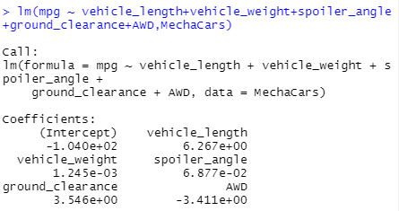
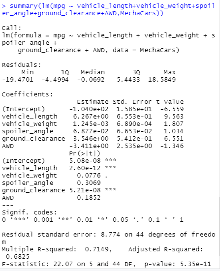
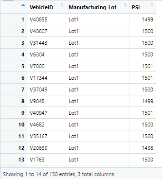
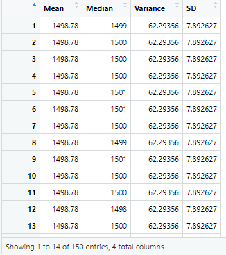
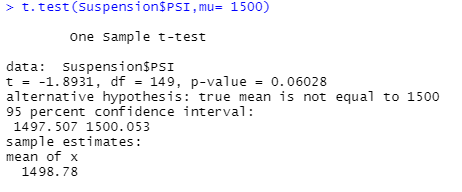
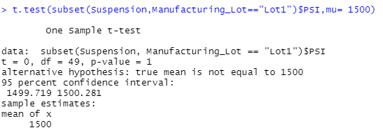
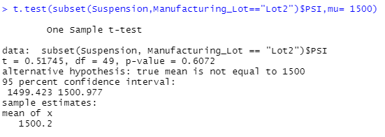
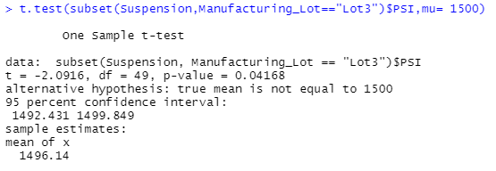

# MechaCar_Statistical_Analysis

# Deliverable 1

## Linear Regression to Predict MPG
	A couple variables/coefficients that provided a non-random amount of variance to the mpg values in the dataset were the ground_clearance and vehicle_length. The slope of the linear model is not considered to be zero. The p-value is less than 0.05. This linear model will predict mpg of MechaCar prototypes effectively. Our R-squared value is 71%.

# Deliverable 2

## Summary Statistics on Suspension Coils
    The design specifications for the MechaCar suspension coils dictate that the variance of the suspension coils must not exceed 100 pounds per square inch. Therefore the current manufacturing data needs to meet this design specification for all manufacturing lots in total. Lot 1 and Lot 2 must have the same exact mean and median. Lot 3 exceeds the manufacturers specifications by showing the most variance.

# Deliverable 3
## T-Tests on Suspension Coils

# Deliverable 4
## Study Design: MechaCar vs Competition
	What metric or metrics are you going to test? Horsepower/engine
	What is the null hypothesis or alternative hypothesis? It is not different from its competitors.
	What statistical test would you use to test the hypothesis? And why? T-test to compare the population of all types of competitor vehicles.
	What data is needed to run the statistical test? Different types of competitor vehicles. 
